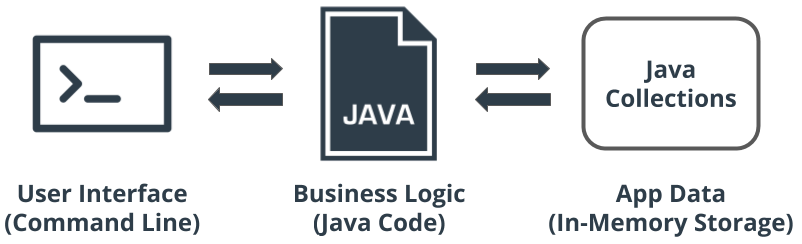
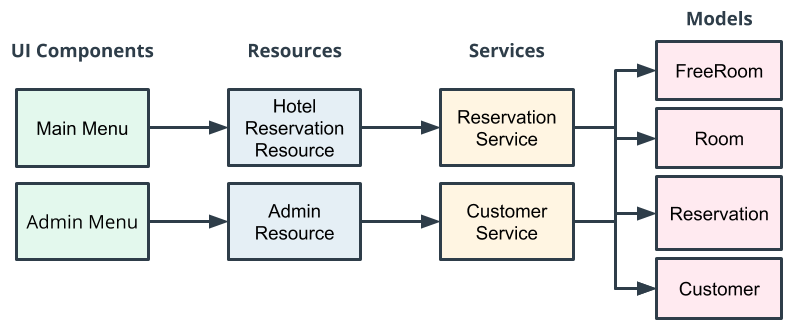

# Hotel Reservation Application

## Overview: Hotel Reservation Application

In this project, you will be designing and implementing a Java hotel reservation application. The hotel reservation application will allow customers to find and book a hotel room based on room availability. This project will demonstrate your abilities to design classes using OOP, organize and process data with collections, and use common Java types.

### Main Components of the App

The major components of the Hotel Reservation Application will consist of the following:

1. **CLI for the User Interface**. We'll use the Command Line Interface (or CLI) for the user interface. For this, we'll need to have Java monitor the CLI for user input, so the user can enter commands to search for available rooms, book rooms, and so on.
2. **Java code**. The second main component is the Java code itself—this is where we add our business logic for the app.
3. **Java collections**. Finally, we'll use Java collections for in-memory storage of the data we need for the app, such as the users' names, room availability, and so on.

### Application Architecture

Let's talk about the structure or architecture of the application. The app will be separated into the following layers:

1. **User interface (UI)**, including a main menu for the users who want to book a room, and an admin menu for administrative functions.
2. **Resources** will act as our Application Programming Interface (API) to our UI.
3. **Services** will communicate with our resources, and each other, to build the business logic necessary to provide feedback to our UI.
4. **Data models** will be used to represent the domain that we're using within the system (e.g., rooms, reservations, and customers).

### Layers

An important thing to notice about this architecture is how we use layers to support modularization and decoupling. For example, If we later decided to change our UI components to a webpage instead of a command-line interface, layering would support this.

> [!TIP]
> Layering is achieved by ensuring there are no cross-communication calls from one layer to another.

For example, a UI component should never communicate directly with a service. This would expose the service implementation to the UI and make it difficult for us to change it out later.

## Project Requirements

When building an app, it is common as a developer to be given a specification or set of requirements for how the app should work and what it should do. This page provides the required features for the Hotel Reservation App.

Remembering and applying these requirements will be easiest if you notice the reasons for them—for example, one requirement is that two people should not be able to book the same room on the same date. That requirement is a realistic one for any functional reservation app that isn't going to drive its users crazy!

**Note**: You don't need to memorize the information here—rather, you’ll want to refer to these requirements as you build your application. We suggest that you either print this page or open it in a new tab.

Once you submit your project, we'll review your work and give you feedback if there's anything that you need to work on. If you'd like to see the exact points that your reviewer will check for when looking at your work, you can have a look over the project rubric.

### User Scenarios

The application provides four user scenarios:

- **Creating a customer account**. The user needs to first create a customer account before they can create a reservation.

- **Searching for rooms**. The app should allow the user to search for available rooms based on provided checkin and checkout dates. If the application has available rooms for the specified date range, a list of the corresponding rooms will be displayed to the user for choosing.

- **Booking a room**. Once the user has chosen a room, the app will allow them to book the room and create a reservation.

- **Viewing reservations**. After booking a room, the app allows customers to view a list of all their reservations.

### Admin Scenarios

The application provides four administrative scenarios:

- **Displaying all customers accounts**.
- **Viewing all of the rooms in the hotel**.
- **Viewing all of the hotel reservations**.
- **Adding a room to the hotel application**.

### Reserving a Room – Requirements

The application allows customers to reserve a room. Here are the specifics:

- **Avoid conflicting reservations**. A single room may only be reserved by a single customer per check-in and check-out date range.
- **Search for recommended rooms**. If there are no available rooms for the customer's date range, a search will be performed that displays recommended rooms on alternative dates. The recommended room search will add seven days to the original check-in and check-out dates to see if the hotel has any availabilities and then display the recommended rooms/dates to the customer.

**Example**: If the customers date range search is 1/1/2020 – 1/5/2020 and all rooms are booked, the system will search again for recommended rooms using the date range 1/8/2020 - 1/12/2020. If there are no recommended rooms, the system will not return any rooms.

> [!TIP]
> **Rubric Tip**: The reservation should use loops to process the data when finding an open room.

- Test the application to make sure rooms can be found based on different dates from the Main menu.
- Test the application to search for rooms that are already booked to make sure a recommended list of rooms is returned.

### Room Requirements

- **Room cost**. Rooms will contain a price per night. When displaying rooms, paid rooms will display the price per night and free rooms will display "Free" or have a $0 price.
- **Unique room numbers**. Each room will have a unique room number, meaning that no two rooms can have the same room number.
- **Room type**. Rooms can be either single occupant or double occupant (Enumeration: SINGLE, DOUBLE).

### Customer Requirements

The application will have customer accounts. Each account has:

- **A unique email for the customer.** RegEx is used to check that the email is in the correct format (i.e., name@domain.com).
- **A first name and last name**.

The email RegEx is simple for the purpose of this exercise and may not cover all real-world valid emails. For example "name@domain.co.uk" would not be accepted by the above RegEx because it does end with ".com". If you would like to try to make your RegEx more sophisticated, you may—but it is not required for this project.

### Error Requirements

The hotel reservation application handles all exceptions gracefully (user inputs included), meaning:

- **No crashing.** The application does not crash based on user input.
- **No unhandled exceptions**. The app has try and catch blocks that are used to capture exceptions and provide useful information to the user. There are no unhandled exceptions.

> [!TIP]
> **Tip**: There should exist at least one example in the model classes (Room, Customer, Reservation) that overrides both the hashcode and equals methods to utilize Collections functions like contains.

### Setup

Below are the steps you'll need to complete to get set up for the project. If you've been following along with the course and already have IntelliJ installed, along with an up-to-date version of Java, then the only step you'll need to complete is the last one (creating a new Java project).

Before going further, be sure that you've done the following:

- If you're not sure whether your Java version is up to date, check it now. Go to a terminal command prompt and type `java -version`. The version needs to be 14 or higher.
- If you do not have Java 14 or later installed, you can install it now by following [Oracle's Java Installation Guide here](https://docs.oracle.com/en/java/javase/15/install/overview-jdk-installation.html), which has detailed steps for the major operating systems
- If you don't already have it, download the Community Edition of [IntelliJ IDEA](https://www.jetbrains.com/idea/download/). Run the downloaded installer.
- Launch IntelliJ and create a new Java project named `hotel reservation`

### Starter Code

Note that **there is intentionally no starter code provided for this project**—you will be showing off your new Java skills by building the entire app from scratch! Although this may be more challenging, it more realistically simulates the situation you'll experience as a developer. Having created everything with your own two hands, you'll have confidence that you truly have learned how to build a Java application!

## Create Model Classes

In this section, we will need to create model classes in order to model our data objects for the hotel reservation domain. For example, the hotel reservation application domain will include data models, like `Customer`, `Room` and `Reservation`.

Here are the steps you'll need to complete to create the model classes:

- Now it's time to create our `model` package so we can start to add our data model classes.
  - Create a new package under the `src` folder named `model`
- Next you'll need to create the `RoomType` enumeration. The `RoomType` should have the following enumerations:
  - `SINGLE`
  - `DOUBLE`
- Next you'll need to create the `IRoom` Interface. It should have the following methods:
  - `public String getRoomNumber()`
  - `public Double getRoomPrice()`
  - `public RoomType getRoomType()`
  - `public boolean isFree()`
- Next you'll need to create the `Room` class. It should have the following:
  - Implement the `IRoom` interface and its methods
  - Add variable `String roomNumber`
  - Add variable `Double price`
  - Add variable `RoomType enumeration`
  - Override the `toString()` method for a better description
- Next you'll need to create the `FreeRoom` class. It should have the following:
  - Extend the `Room` class
  - Change the constructor to set the `price` to `0`
  - Override the `toString` method for a better description
- Next you'll need to create the `Customer` class. It should have the following:
  - Add variable `String firstName`
  - Add variable `String lastName`
  - Add variable `String email`
  - Override the `toString()` method for a better description
  - Add a validation step in the class constructor to check the email format. The email should look like "name@domain.extension" (e.g. user@example.com). It should allow different endings (.com, .net, .org, etc.). If the email is not in this format, throw an `IllegalArgumentException`. This ensures we accept a wide range of email addresses.
- Next you'll need to create the `Reservation` class. It should have the following:
  - Add variable `Customer customer`
  - Add variable `IRoom room`
  - Add variable `Date checkInDate`
  - Add variable `Date checkOutDate`
  - Override the `toString()` method for a better description

**Additional Resources:** [Equals and HashCode Methods](https://www.technofundo.com/tech/java/equalhash.html)

## Test Your Code

There are many different techniques for testing software, As you continue to learn Java, you should be sure to learn about unit testing frameworks (such as JUnit). However, for the hotel reservation application, you can create a driver program to incrementally test your software as you develop it.

- Here are the steps to test the `Driver` class:
  - Create a Java class and name it `Driver` or `Tester`
  - Include a `main` method: `public static void main (String[] args) {}`
  - Add `Customer customer = new Customer("first", "second", "j@domain.com");`
  - Next line add `System.out.println(customer);`. Note: if you have overridden the `toString()` method for the `Customer` class, this line will display the class contents
- Let's use this technique to test your email validation:
  - Add `Customer customer = new Customer("first", "second", "email");`
  - Run the `Driver` program by right-clicking and selecting Run
  - An `IllegalArgumentException` should have been thrown because the String `email` does not match our regular expression for email, `name@domain.com`

## Create Service Classes

In this part, we'll make special classes called services. These services will help us do things that don't fit into our main class. Services can either remember things (stateful) or not remember things (stateless). Our services will remember things for our project and use Collections to manage information. Since our services remember things, we'll make sure there's only one of each service, like having a special helper who always knows what's happening.

Here's what you need to do to make these service classes:

- Now it's time to create our `service` package so we can start to add our service classes
  - Create a new package under the `src` folder named `service`
- Next you'll need to create the `CustomerService` class. It should have the following:
  - `public void addCustomer(String email, String firstName, String lastName)`
  - `public Customer getCustomer(String customerEmail)`
  - `public Collection<Customer> getAllCustomers`
  - Provide a `static` reference
- Next you'll need to create the `ReservationService` class. It should have the following:
  - `public void addRoom(IRoom room)`
  - `public IRoom getARoom(String roomId)`
  - `public Reservation reserveARoom(Customer customer, IRoom room, Date checkInDate, Date checkOutDate)`
  - `public Collection<Reservation> getCustomersReservation(Customer customer)`
  - `public void printAllReservation()`
  - Create `Collections` to store and retrieve a `Reservation`
  - Provide a `static` reference

## Create Resource Classes

In this section, we will need to create the resource classes so we can provide an intermediary between the UI components and services. Resource classes are used for defining the Application Programming Interface (API).

> [!NOTE]
> **Note**: APIs are a best practice and used to separate backend software from frontend software. This provides a clean separation in behavior and responsibilities for the software components.

The hotel reservation application will have two resources, the `HotelResource` intended for public usage and the `AdminResource` intended for the hotel staff only.

Here are the main steps you'll need to complete to create the service classes:

- Now it's time to create our `api` package so we can start to add our api classes.
  - Create a new package under `src` named `api`
- Next you'll need to create the `HotelResource` class. The `HotelResource` should have little to no behavior contained inside the class and should make use of the Service classes to implement its methods. The `HotelResource` will have the following methods:
  - Provide a `static` reference
  - `public Customer getCustomer(String email)`
  - `public void createACustomer(String email, String firstName, String lastName)`
  - `public IRoom getRoom(String roomNumber)`
  - `public Reservation bookARoom(String customerEmail, IRoom room, Date checkInDate, Date checkOutDate)`
  - `public Collection<IRoom> findARoom(Date checkIn, Date checkOut)`
- Next you'll need to create the `AdminResource` class. The `AdminResource` should have little to no behavior contained inside the class and should make use of the Service classes to implement its methods. The `AdminResource` will have the following methods:
  - Provide a `static` reference
  - `public Customer getCustomer(String email)`
  - `publc void addRoom(List<IRoom> rooms)`
  - `public Collection<IRoom> getAllRooms()`
  - `public Collection<Customer> getAllCustomers()`
  - `public void displayAllReservations()`

